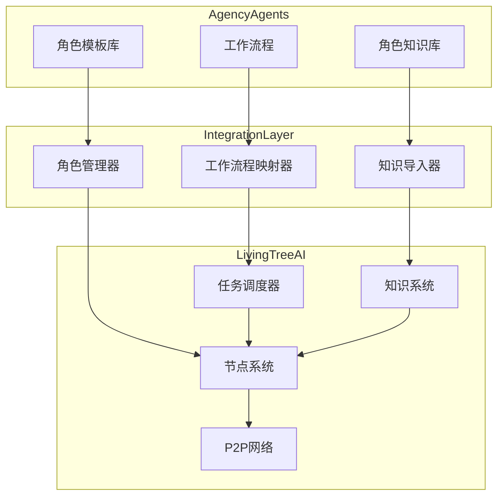

# Agency-Agents 集成架构设计

## 1. 集成目标

将 agency-agents 的 140+ 专业角色和工作流程集成到 LivingTreeAI 分布式系统中，实现以下目标：

- 丰富 LivingTreeAI 的专业能力覆盖
- 提供标准化的工作流程执行
- 实现角色知识的分布式共享
- 优化任务分配和执行效率

## 2. 架构设计

### 2.1 核心组件



### 2.2 角色系统集成

#### 角色映射

| Agency-Agents 角色 | LivingTreeAI 节点类型 | 专业领域 |
|-------------------|---------------------|----------|
| 工程类（前端、后端、全栈） | SPECIALIZED | engineering |
| 设计类（UI/UX、图形设计） | SPECIALIZED | design |
| 产品类（产品经理、产品运营） | SPECIALIZED | product |
| 营销类（内容营销、社交媒体） | SPECIALIZED | marketing |
| 数据分析类 | SPECIALIZED | data_analysis |
| 法律类 | SPECIALIZED | legal |
| 医疗类 | SPECIALIZED | medical |
| 管理类（项目经理、团队领导） | COORDINATOR | management |

#### 角色能力模型

```python
class RoleCapability:
    """角色能力模型"""
    def __init__(self, role_name, domain, skills, workflow, deliverables):
        self.role_name = role_name
        self.domain = domain
        self.skills = skills  # 技能列表
        self.workflow = workflow  # 工作流程
        self.deliverables = deliverables  # 交付物模板
```

### 2.3 工作流程映射

#### 工作流程到任务链的转换

1. **工作流程解析**：解析 agency-agents 的工作流程定义
2. **任务分解**：将工作流程分解为多个子任务
3. **任务映射**：将子任务映射到 LivingTreeAI 的任务类型
4. **依赖管理**：处理任务间的依赖关系

#### 任务类型映射

| 工作流程步骤 | LivingTreeAI 任务类型 |
|-------------|----------------------|
| 需求分析 | inference |
| 设计规划 | inference |
| 代码实现 | inference |
| 测试验证 | inference |
| 部署发布 | coordination |
| 知识存储 | storage |

### 2.4 知识系统集成

#### 知识分类

1. **角色知识**：角色定义、技能要求、工作流程
2. **领域知识**：专业领域的基础知识和最佳实践
3. **经验知识**：从任务执行中积累的经验

#### 知识存储结构

```python
class RoleKnowledge:
    """角色知识库"""
    def __init__(self):
        self.knowledge_base = {}
    
    def add_role_knowledge(self, role_name, knowledge):
        """添加角色知识"""
        self.knowledge_base[role_name] = knowledge
    
    def get_role_knowledge(self, role_name):
        """获取角色知识"""
        return self.knowledge_base.get(role_name, {})
```

## 3. 集成实现

### 3.1 目录结构

```
core/living_tree_ai/agency_integration/
├── __init__.py
├── role_manager.py       # 角色管理
├── workflow_mapper.py    # 工作流程映射
├── knowledge_importer.py # 知识导入
├── role_templates/       # 角色模板
└── workflows/            # 工作流程定义
```

### 3.2 核心 API

#### 角色管理器

```python
class RoleManager:
    """角色管理器"""
    def __init__(self):
        self.roles = {}
        self.load_role_templates()
    
    def load_role_templates(self):
        """加载角色模板"""
        # 从 agency-agents 导入角色模板
    
    def create_role_node(self, role_name):
        """创建角色节点"""
        # 根据角色创建专业节点
    
    def get_role_by_domain(self, domain):
        """根据领域获取角色"""
        # 返回指定领域的角色列表
```

#### 工作流程映射器

```python
class WorkflowMapper:
    """工作流程映射器"""
    def __init__(self):
        self.workflows = {}
        self.load_workflows()
    
    def load_workflows(self):
        """加载工作流程"""
        # 从 agency-agents 导入工作流程
    
    def map_to_task_chain(self, workflow_name, input_data):
        """将工作流程映射为任务链"""
        # 生成任务链
```

#### 知识导入器

```python
class KnowledgeImporter:
    """知识导入器"""
    def __init__(self, knowledge_base):
        self.knowledge_base = knowledge_base
    
    def import_role_knowledge(self, role_name):
        """导入角色知识"""
        # 导入角色相关知识
    
    def import_domain_knowledge(self, domain):
        """导入领域知识"""
        # 导入领域相关知识
```

## 4. 集成流程

### 4.1 初始化流程

1. **加载角色模板**：从 agency-agents 导入角色模板
2. **创建角色节点**：为每个角色创建专业节点
3. **导入知识**：将角色知识导入到知识库
4. **注册工作流程**：注册工作流程定义

### 4.2 任务执行流程

1. **任务接收**：接收用户任务请求
2. **角色匹配**：根据任务类型匹配最合适的角色
3. **工作流程选择**：选择适合的工作流程
4. **任务链生成**：生成任务链
5. **任务分配**：分配任务到相应节点
6. **执行监控**：监控任务执行状态
7. **结果整合**：整合任务结果

## 5. 性能优化

### 5.1 任务分配优化

- **能力匹配**：基于节点能力和任务需求进行匹配
- **负载均衡**：考虑节点当前负载
- **网络延迟**：考虑节点网络延迟
- **历史表现**：考虑节点历史执行表现

### 5.2 知识管理优化

- **知识缓存**：缓存常用角色知识
- **知识更新**：定期更新角色知识
- **知识共享**：在节点间共享知识
- **知识压缩**：压缩存储知识

## 6. 扩展与维护

### 6.1 角色扩展

- **自定义角色**：支持用户自定义角色
- **角色组合**：支持角色能力组合
- **角色进化**：基于执行结果优化角色能力

### 6.2 工作流程扩展

- **自定义工作流程**：支持用户自定义工作流程
- **工作流程模板**：提供工作流程模板
- **工作流程优化**：基于执行结果优化工作流程

### 6.3 知识扩展

- **知识贡献**：支持用户贡献知识
- **知识验证**：验证知识质量
- **知识演进**：基于反馈改进知识

## 7. 测试与验证

### 7.1 功能测试

- **角色创建测试**：测试角色节点创建
- **工作流程执行测试**：测试工作流程执行
- **知识导入测试**：测试知识导入
- **任务分配测试**：测试任务分配

### 7.2 性能测试

- **响应时间测试**：测试任务响应时间
- **吞吐量测试**：测试系统吞吐量
- **扩展性测试**：测试系统扩展性
- **稳定性测试**：测试系统稳定性

## 8. 集成价值

- **丰富专业能力**：140+ 专业角色覆盖多个领域
- **标准化流程**：提供标准化的工作流程
- **知识共享**：实现角色知识的分布式共享
- **效率提升**：优化任务分配和执行
- **持续进化**：通过联邦学习不断提升角色能力

## 9. 未来展望

- **自组织角色网络**：角色节点自动形成专业网络
- **动态角色进化**：基于实际执行效果自动调整角色能力
- **跨领域协作**：不同专业角色节点协同完成复杂任务
- **智能工作流程**：基于 AI 优化工作流程
- **生态系统扩展**：构建角色和工作流程的生态系统