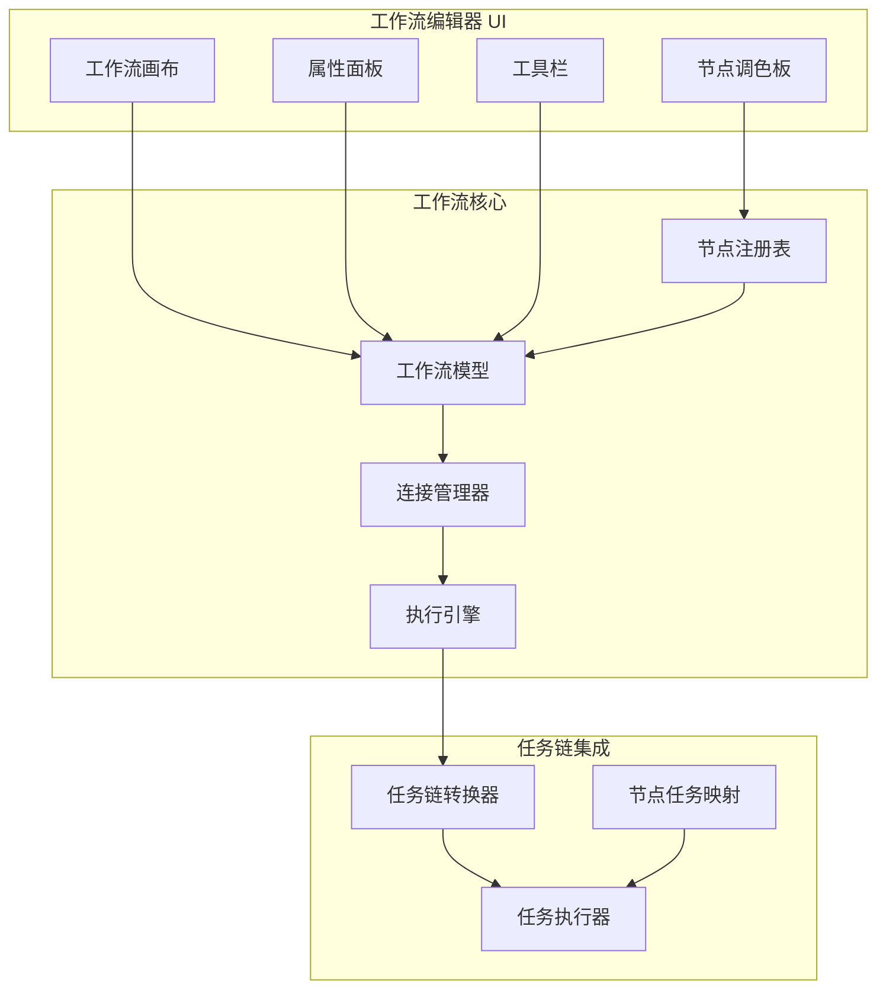
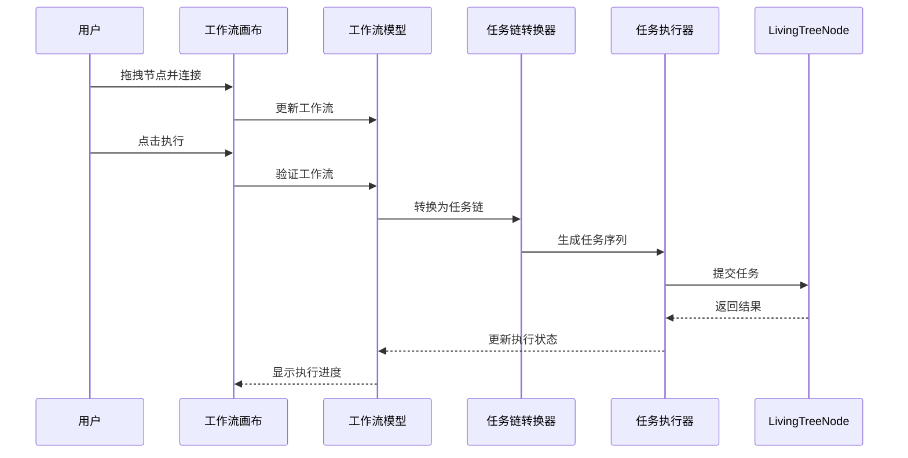

# 可视化工作流编辑器架构设计

## 1. 概述

本文档设计一个可视化工作流编辑器，参考 Dify 的设计理念，与 LivingTreeAI 的分布式架构集成。

### 1.1 设计目标

- 提供可视化的 AI 工作流编辑界面
- 支持拖拽式节点连接
- 实现工作流到任务链的自动转换
- 支持分布式执行和监控

### 1.2 参考 Dify 的设计

Dify 的工作流特性：
- 可视化画布编辑
- 节点类型丰富（LLM、工具、知识库、条件等）
- 支持条件分支和循环
- 实时执行预览

## 2. 架构设计

### 2.1 核心组件



### 2.2 目录结构

```
core/living_tree_ai/workflow/
├── __init__.py
├── models/
│   ├── __init__.py
│   ├── workflow.py          # 工作流模型
│   ├── node.py              # 节点模型
│   ├── connection.py         # 连接模型
│   └── types.py             # 类型定义
├── registry/
│   ├── __init__.py
│   ├── node_registry.py     # 节点注册表
│   └── builtin_nodes.py     # 内置节点类型
├── engine/
│   ├── __init__.py
│   ├── executor.py          # 执行引擎
│   ├── converter.py         # 任务链转换器
│   └── validator.py         # 工作流验证器
└── ui/
    ├── __init__.py
    ├── workflow_panel.py    # 工作流面板
    ├── canvas.py            # 画布组件
    ├── node_widget.py       # 节点组件
    └── palette.py            # 节点调色板

ui/
├── workflow_panel/
│   ├── __init__.py
│   └── workflow_editor.py   # 工作流编辑器主面板
```

### 2.3 节点类型设计

#### 内置节点类型

| 节点类型 | 描述 | 对应 LivingTreeAI |
|---------|------|------------------|
| LLM Node | 大语言模型调用 | 推理节点 (inference) |
| Tool Node | 工具调用 | 工具执行节点 |
| Knowledge Node | 知识库检索 | 知识系统节点 |
| Condition Node | 条件分支 | 协调节点逻辑 |
| Loop Node | 循环节点 | 协调节点循环 |
| Start Node | 开始节点 | 任务入口 |
| End Node | 结束节点 | 任务出口 |
| Template Node | 模板节点 | 代码生成节点 |
| Transformer Node | 数据转换 | 存储节点 |

#### 节点模型

```python
@dataclass
class WorkflowNode:
    node_id: str
    node_type: NodeType
    name: str
    description: str
    position: Position
    config: Dict[str, Any]
    inputs: List[Port]
    outputs: List[Port]
    status: NodeStatus = NodeStatus.IDLE

@dataclass
class NodeConnection:
    connection_id: str
    source_node_id: str
    source_port: str
    target_node_id: str
    target_port: str

@dataclass
class Workflow:
    workflow_id: str
    name: str
    description: str
    nodes: List[WorkflowNode]
    connections: List[NodeConnection]
    variables: Dict[str, Any]
    created_at: float
    updated_at: float
```

### 2.4 执行流程



## 3. UI 设计

### 3.1 工作流编辑器布局

```
┌─────────────────────────────────────────────────────────────────┐
│  文件  编辑  视图  帮助                      工作流编辑器      │
├─────────────────────────────────────────────────────────────────┤
│  ┌───────┐  ┌─────────────────────────────────────────────────┐│
│  │ 节点  │  │                                                 ││
│  │ 调色板 │  │              工作流画布                         ││
│  │       │  │                                                 ││
│  │ ○开始  │  │     ┌─────┐         ┌─────┐                   ││
│  │ ○LLM  │  │     │Start│────────▶│ LLM │                   ││
│  │ ○工具 │  │     └─────┘         └─────┘                   ││
│  │ ○知识 │  │                       │                         ││
│  │ ○条件 │  │                       ▼                         ││
│  │ ○循环 │  │                 ┌─────┐     ┌─────┐            ││
│  │       │  │                 │工具 │◀───▶│知识 │            ││
│  │       │  │                 └─────┘     └─────┘            ││
│  │       │  │                       │                         ││
│  │       │  │                       ▼                         ││
│  │       │  │                     ┌─────┐                    ││
│  │       │  │                     │结束 │                    ││
│  │       │  │                     └─────┘                    ││
│  └───────┘  └─────────────────────────────────────────────────┘│
├─────────────────────────────────────────────────────────────────┤
│  属性面板                                                        │
│  ┌─────────────────────────────────────────────────────────────┐│
│  │ 节点: LLM                                                   ││
│  │ 名称: [文本分析________]                                    ││
│  │ 模型: [GPT-4___________] ▼                                 ││
│  │ 提示词:                                                     ││
│  │ ┌─────────────────────────────────────────────────────────┐││
│  │ │ 分析以下文本: {{input}}                                  │││
│  │ └─────────────────────────────────────────────────────────┘││
│  └─────────────────────────────────────────────────────────────┘│
├─────────────────────────────────────────────────────────────────┤
│  执行日志                                                        │
│  [2024-01-01 10:00:00] 开始执行工作流                            │
│  [2024-01-01 10:00:01] 节点 Start 完成                           │
│  [2024-01-01 10:00:02] 节点 LLM 执行中...                        │
└─────────────────────────────────────────────────────────────────┘
```

### 3.2 节点组件设计

每个节点组件包含：
- 节点标题栏（显示节点类型和名称）
- 节点图标
- 输入/输出端口
- 状态指示器（idle/running/completed/error）
- 预览信息（显示关键输出）

## 4. 任务链转换

### 4.1 转换规则

| 工作流节点 | 任务类型 | 输入数据 | 输出数据 |
|-----------|---------|---------|---------|
| Start | - | - | {variables} |
| LLM | inference | {prompt, context} | {response} |
| Tool | tool | {tool_name, args} | {result} |
| Knowledge | storage | {query} | {documents} |
| Condition | coordination | {condition} | {branch} |
| Loop | coordination | {iterable} | {results} |
| End | - | {result} | - |

### 4.2 转换算法

```python
def convert_to_task_chain(workflow: Workflow) -> List[Task]:
    # 1. 拓扑排序获取执行顺序
    execution_order = topological_sort(workflow)
    
    # 2. 按顺序转换每个节点
    task_chain = []
    context = {}
    
    for node in execution_order:
        if node.type == NodeType.START:
            context.update(node.output)
        elif node.type == NodeType.LLM:
            task = create_inference_task(node, context)
            task_chain.append(task)
        elif node.type == NodeType.TOOL:
            task = create_tool_task(node, context)
            task_chain.append(task)
        # ... 其他节点类型
        
    return task_chain
```

## 5. 与 LivingTreeAI 集成

### 5.1 集成点

1. **节点系统集成**
   - 工作流执行器 → LivingTreeNode
   - 任务提交 → 节点任务队列

2. **知识系统集成**
   - Knowledge Node → KnowledgeBase
   - 检索结果 → 工作流变量

3. **OpenHarness 集成**
   - Tool Node → OpenHarness ToolSystem
   - LLM Node → OpenHarness Engine

4. **监控集成**
   - 执行状态 → UI 状态栏
   - 错误信息 → 日志面板

### 5.2 数据流

```
用户编辑工作流 → 保存工作流定义 → 转换为任务链 → 提交到节点 → 执行并监控
```

## 6. 未来扩展

1. **模板市场**
   - 预设工作流模板
   - 用户自定义模板

2. **版本控制**
   - 工作流版本历史
   - 回滚功能

3. **协作功能**
   - 多用户同时编辑
   - 实时同步

4. **AI 辅助**
   - 自动生成工作流
   - 智能节点推荐